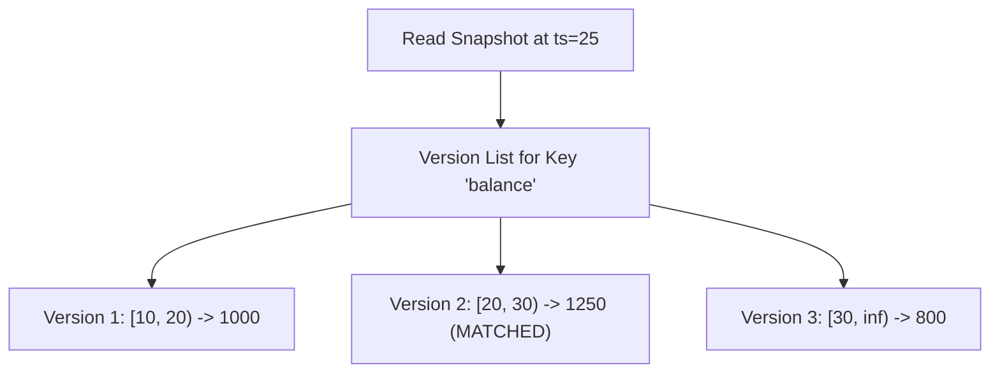

# MVCC Snapshot Isolation Engine Skill

Robust, zero-dependency Python implementation of **Multi-Version Concurrency Control (MVCC)** supporting non-blocking concurrent reads and writes with periodic epoch vacuuming.

## Features
- **Temporal Version Visibility**: Every record maintains `created_ts` and `expired_ts` intervals.
- **Lock-Free Reads**: Concurrent reads never block concurrent writes; reads observe pure immutable point-in-time snapshots.
- **Epoch Garbage Collection**: Vacuuming cleans obsolete record versions safely below active transaction watermarks.
- **Zero External Dependencies**: Pure Python standard library.
- **Native MCP Protocol**: JSON-RPC 2.0 stdio server compatible with Claude Desktop, Cursor, and Windsurf.

## Architecture

